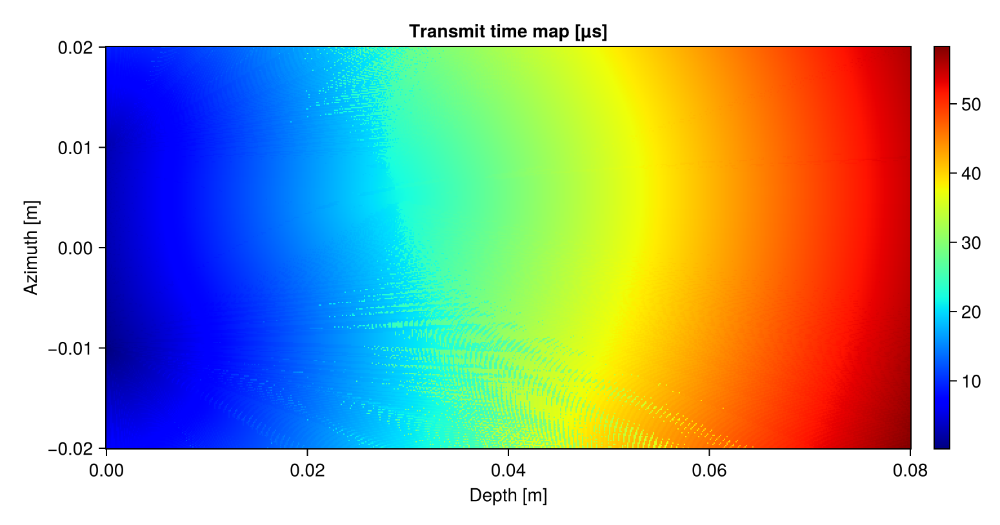

# Wave propagation simulator

Simulates the propagation of waves from multiple transmitting elements.

## Package status

| Windows |
|-------|
|[](https://ci.appveyor.com/project/cmey/wavesim-jl)|

## Installation

Until this package gets registered, open the Julia environment from inside the package folder:
```
julia --project=.
```

## Usage

```
using WaveSim

# Define simulation parameters (use many default values, see the WaveSimParameters struct).
sim_params = WaveSimParameters(
    focus_depth = 0.03,  # [m]
    steer_angle = 10.0,  # [deg]
    aperture_size = 0.02,  # [m]
);

# Compute focusing delay for the elements of the phased array.
trans_delays = WaveSim.delays_from_focus_and_steer(sim_params);

# (optional) Compute optimized "best" spatial and temporal parameters.
sim_params = WaveSim.autores(sim_params, trans_delays)

# Run the simulation.
images = WaveSim.wavesim(trans_delays, sim_params);
beam_energy_map, transmit_time_map = WaveSim.beam_energy_map_and_transmit_time_map(images, sim_params);

# Display results.
include("src/view.jl")
imshowall(images, beam_energy_map, transmit_time_map, sim_params);

# Save results.
include("src/save.jl")
saveall(images, beam_energy_map, transmit_time_map, sim_params, "images")
```

Visualize the wave propagating through space, over time:


Get a spatial heatmap of where the energy went:


Know the transmit time delay everwhere in space:



## Tips

### Parallelization

The code supports multi-threading, make use of it by setting:

`export JULIA_NUM_THREADS=4` (or whatever number of cores your machine has), before starting `julia`

or start `julia` directly with:

    JULIA_NUM_THREADS=`getconf _NPROCESSORS_ONLN` julia
