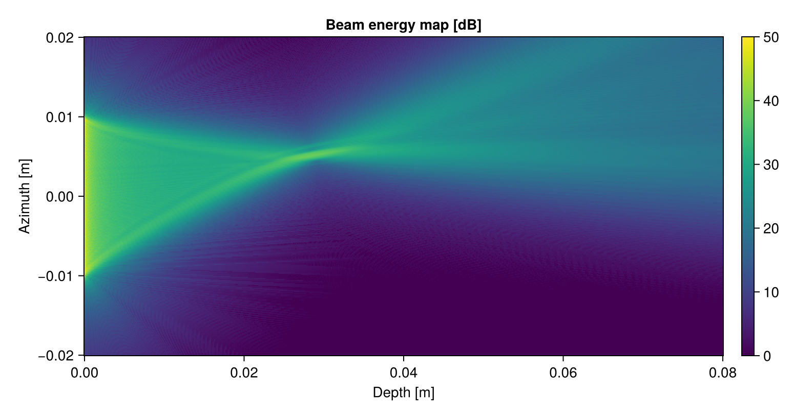

# Wave propagation simulator

Simulates the propagation of waves from multiple transmitting elements.

## Package status

| macOS | Linux | Windows |
|-------|-------|---------|
|[](https://travis-ci.org/cmey/WaveSim.jl)|[](https://travis-ci.org/cmey/WaveSim.jl)|[](https://ci.appveyor.com/project/cmey/wavesim-jl)|

## Usage

```
include("WaveSim.jl")
using WaveSim

# Setup parameters.
focus = 0.03  # [m]
steer = 0.0  # [deg]
aperture_size = 0.01  # [m]

# Compute focusing delays for the elements of the phased array.
trans_delays = WaveSim.delays_from_focus_and_steer(focus, steer, aperture_size)

# Run the simulation.
images = WaveSim.wavesim(trans_delays)

# Display results.
include("view.jl")
imshowall(images)
```

Visualize the wave propagating through space, over time:


Get a spatial heatmap of where the transmitted energy is sent:



Know the transmit time delay everwhere in space:


## Tips

### Parallelization

The code supports multi-threading, make use of it by setting:

`export JULIA_NUM_THREADS=4` (or whatever number of cores your machine has), before starting `julia`

or start `julia` directly with:

    JULIA_NUM_THREADS=`getconf _NPROCESSORS_ONLN` julia

