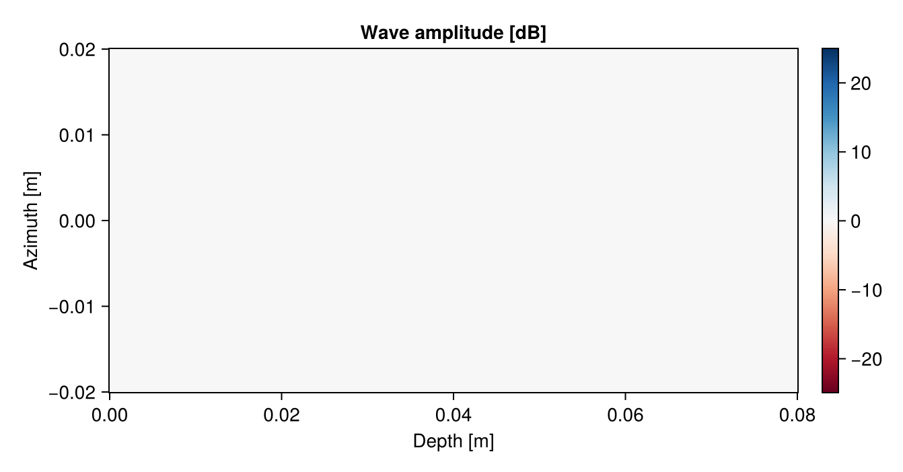
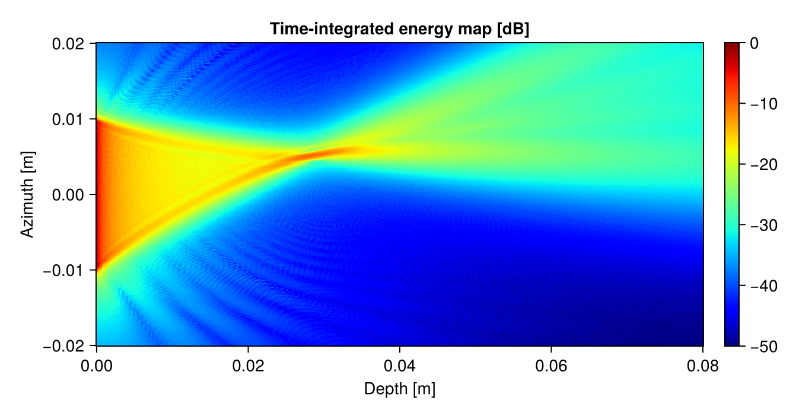
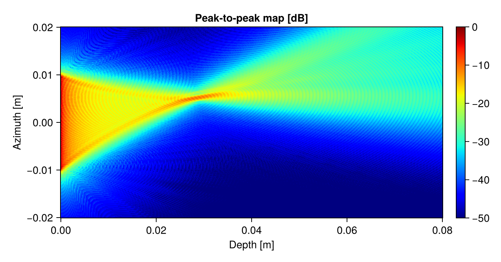
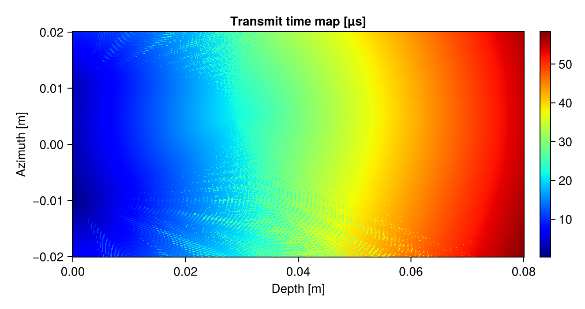
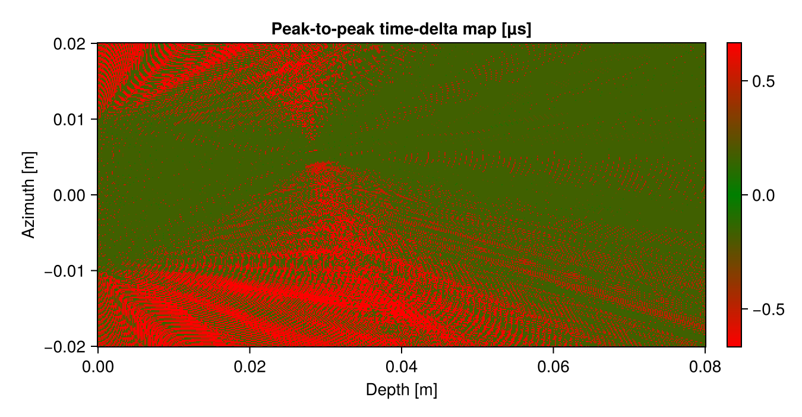

# Wave propagation simulator

Simulates the interference and propagation of waves from multiple transmitting elements.

## Package status


## Installation

The package is registered, so one can simply:
```
using Pkg
Pkg.add("WaveSim")
```

For development, open the Julia environment from inside this package folder. It will re-precompile an up-to-date version with any local change:
```
julia --project=.
```

## Usage

```julia
{{INJECT:src/main.jl}}
```

Visualize the wave propagating through space, over time:



Get a spatial heatmap of where the max-SPL-windowed energy went:


Get a spatial heatmap of where the time-integrated energy went:



Get a spatial heatmap of the peak-to-peak amplitude:



Get a spatial heatmap of the transmit time delay to the peak amplitude:



Get a spatial heatmap of the peak-to-peak time delta (can indicate where the peak-to-peak estimations are reasonable):




## Tips

### Parallelization

The code supports multi-threading, make use of it by starting Julia with multiple threads: `julia --threads 4 --project=.`

### CUDA backend

If `CUDA.jl` is available in the active environment (`import CUDA`) and a functional
NVIDIA GPU is present, the simulation can be run on the GPU with:
`WaveSim.wavesim(trans_delays, sim_params; backend = :cuda)`.
A comparison script is available at `scripts/benchmark_cuda.jl`.
